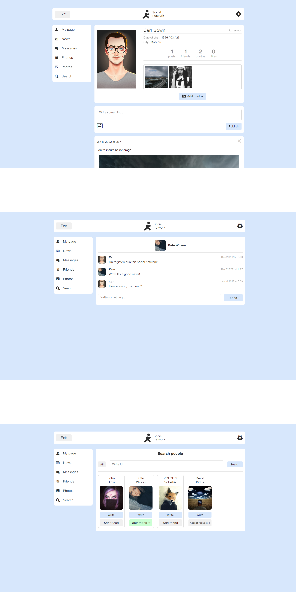

### [Social-network - Fullstack SPA приложение на React/NodeJs/PostgreSQL.](https://stalise.github.io/)
Приложение предоставляет функционал социальной сети. Мною разработан: дизайн, фронтенд, бекенд, архитектура таблиц в базе данных. Деплой фронтенда на GitHub, а бекенда на Heroku.
На данный момент мое самое большое приложение на React.

##### Функционал включает в себя: 
* Регистрация/вход пользователя.
* Редактирование профиля.
* Добавление в друзья (имеет несколько стадий).
* Создание/удаление постов.
* Добавление картинок в профиль или к постам.
* Лайки.
* Отправка и принятие сообщений в реальном времени (long polling).
* Показ новостей (постов людей которые у вас в друзьях).
* Поиск пользователей по id.

##### Стек фронтенда:
* HTML
* SCSS
* JS
* React / React-router(v6) / React-hook-form
* Redux / Redux-thunk

##### Стек бекенда:
* NodeJs
* ExpressJs
* PostgreSQL
* Cloudinary (облачное хранилище изображений)
* RESTfull API

##### Обзор:

Кто досмотрел до конца - тот молодец 👍  
Если нет желания регистрироваться, тестовые данные для входа:  
username - testacc  
password - zoro00  
